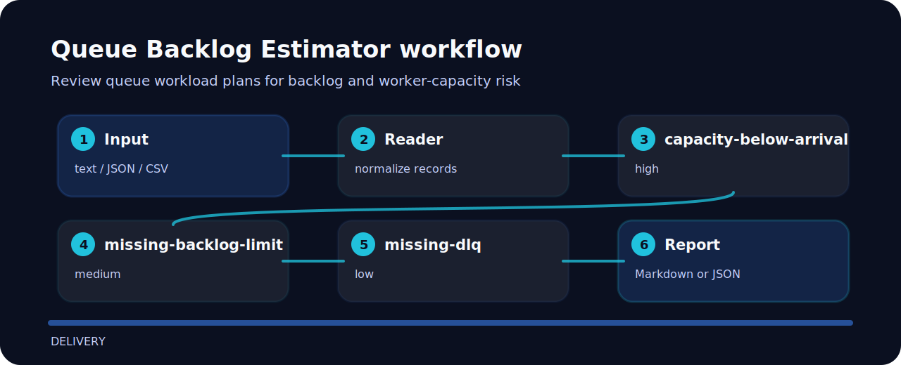

# Queue Backlog Estimator


Review queue workload plans for backlog and worker-capacity risk.

## Input contrast

The sample fixture in `examples/` is the quickest way to see the check fire.

## Checks in plain language

| Signal | Level | What it flags | Fix direction |
| --- | --- | --- | --- |
| `capacity-below-arrival` | high | worker capacity appears below arrival rate | Increase workers, reduce arrival rate, or add backpressure. |
| `missing-backlog-limit` | medium | backlog limit is missing | Set queue depth alerts and discard policy. |
| `missing-dlq` | low | dead-letter queue is missing | Add DLQ handling for poisoned messages. |

## How the check reads



## Run the sample

```bash
git clone https://github.com/mertefekurt/queue-backlog-estimator.git
cd queue-backlog-estimator
python -m pip install -e ".[dev]"
queue-backlog-estimator examples/sample.txt
```
