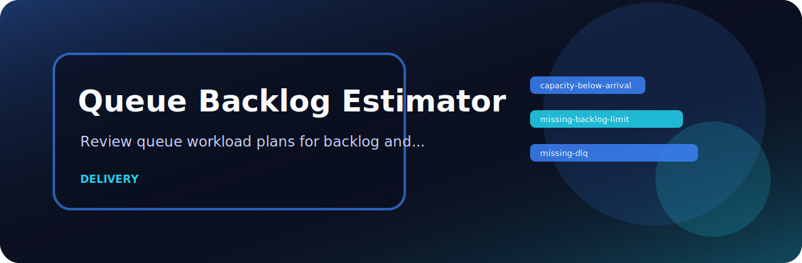

# Queue Backlog Estimator

<p align="center">
  
</p>

   

Review queue workload plans for backlog and worker-capacity risk.

## The short version

`queue-backlog-estimator` is intentionally small: feed it a file, get deterministic findings, and decide whether the result should block a merge or just guide cleanup.

## Rule surface

| Rule | Severity | What it catches |
| --- | --- | --- |
| `capacity-below-arrival` | high | worker capacity appears below arrival rate |
| `missing-backlog-limit` | medium | backlog limit is missing |
| `missing-dlq` | low | dead-letter queue is missing |

## Usage

```bash
python -m pip install -e ".[dev]"
queue-backlog-estimator examples/sample.txt
queue-backlog-estimator examples/sample.txt --json --fail-on medium
```

## Useful defaults

| Option | Reason |
| --- | --- |
| `--json` | machine-readable output for scripts |
| `--fail-on medium` | stricter CI gate when warnings matter |
| `--format auto` | let the reader detect text, CSV, JSON, or JSONL |

## Local checks

```bash
python -m pip install -e ".[dev]"
ruff check .
pytest
python -m queue_backlog_estimator --help
```
